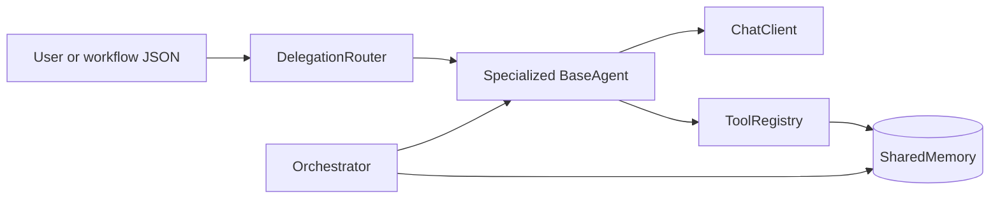

# Multi-Agent orchestration

Python toolkit with specialized agents (research, coding, planner, data, writer, reviewer), **task delegation**, **shared memory**, **orchestration**, and **OpenAI-style tool calling** with offline `MockLLM` tests.

## Features

- **Delegation**: `DelegationRouter` scores keywords and picks an `AgentRole`, defaulting to the planner when nothing matches.
- **Memory**: `SharedMemory` is thread-safe and stores outputs between orchestrated steps or tool calls (`memory_get` / `memory_set`).
- **Orchestration**: `Orchestrator` runs `WorkflowStep` lists, injecting prior memory keys into later prompts and persisting results under stable keys.
- **Tools**: registry exposes OpenAI-compatible schemas; builtins cover memory, workspace reads/writes/globs, CSV summaries, restricted Python snippets, bounded HTTP `fetch_url_text`, web-search stub, and structured workflow validation.

## Setup

```bash
cd "/path/to/Multi Agent"
python -m venv .venv
source .venv/bin/activate
pip install -e ".[dev]"
```

Optional live LLM support uses `OPENAI_API_KEY` (and optionally `OPENAI_BASE_URL`, `OPENAI_MODEL`). Without a key, use `--mock-llm` in the CLI or `MockLLM` in code/tests.

Environment shortcuts:

- `MULTI_AGENT_WORKSPACE` — default workspace when `--workspace` is omitted on `delegate` / `agent`.
- `MULTI_AGENT_MAX_TOOL_LOOPS` — upper bound for agent tool-call iterations (default `12`, capped at `256`).

## CLI

```bash
export PYTHONPATH=src  # only needed before editable install
multi-agent --version
multi-agent delegate "review this API design" --mock-llm
multi-agent delegate "ship checklist" --role planner --mock-llm
multi-agent agent --role data --task "profile sample.csv" --workspace .
multi-agent workflow --file examples/sample_workflow.json --dry-run
multi-agent workflow --file examples/sample_workflow.json --mock-llm
```

Install the `multi-agent` console script after `pip install -e .`:

```bash
multi-agent workflow --file examples/sample_workflow.json --mock-llm
```

## Programmatic use

See `examples/demo_roundtrip.py` for delegation plus a two-step workflow in pure Python.

## Tests

```bash
pytest
# or
bash scripts/verify.sh
```

## Architecture sketch


